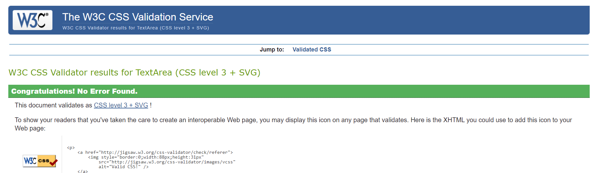

# Let's Play! Rock, Paper, Scissors. 

Let's Play! is a site with a simple Rock, Paper, Scissors game. This game is designed for adults and children alike. It provides the rules of the game, and buttons to select your choice during play. Users will compete against the completely random selection of the computer, ensuring a fair result.

## Features 

### Existing Features

- __The Let's Play! Rock, Paper, Scissors Heading and Sub-Heading__

  - Featured at the top of the page, the Let's Play! heading is easy to see for the user. Upon viewing the page, the user will be able to see the name of the site, and directly below it the name of the game they are about to play.
  

  
  

- __Rules Area__

  - This section has a short explanation of the simple rules of the game.
  - It includes an image as a visual aid.
  

  
  

- __The Game Area__

  - This section will allow the user to play the rock, paper, scissors game. 
  - The user will easily see the three buttons and choose one to select.
  

  
  

-__Results Area__

  - This section will show the player selection, computer selection, and the resulting winner.
  

  
  

- __The Score Area__

  - This section is placed within the footer.
  - It will allow the user to an updating tally of both the player and computer scores.
  

  
  

### Features Left to Implement

-__Future Ideas__

- In the future I would like to add a function to end the game after either the player score or computer score reaches ten points, declare an overall winner, then reset the game.
- More simple games could be added to give variety to the site eg. Tic Tac Toe, a memory game etc.
- A score table could be added so players could log their scores.

## Testing 

### Validator Testing 

- HTML
    - No errors were returned when passing through the official [W3C validator](https://validator.w3.org/nu/?doc=https%3A%2F%2Fcode-institute-org.github.io%2Flove-maths%2F)
    

    
    

- CSS
    - No errors were found when passing through the official [(Jigsaw) validator](https://jigsaw.w3.org/css-validator/validator?uri=https%3A%2F%2Fvalidator.w3.org%2Fnu%2F%3Fdoc%3Dhttps%253A%252F%252Fcode-institute-org.github.io%252Flove-maths%252F&profile=css3svg&usermedium=all&warning=1&vextwarning=&lang=en)
    

    
    

- JavaScript
    - No errors were found when passing through the official [Jshint validator](https://jshint.com/)
      - The following metrics were returned: 
      - There are 7 functions in this file.
      - Function with the largest signature takes 2 arguments, while the median is 0.
      - Largest function has 20 statements in it, while the median is 2.
      - The most complex function has a cyclomatic complexity value of 19 while the median is 1.
      - There are 12 warnings.

      
### Functionality testing

  - I used Chrome developer tools throughout the project for testing and solving problems.

### Compatibility testing

  - Site was tested across multiple virtual mobile devices. I checked all supported devices in Chrome developer tools.
  - Site was tested on several browsers including Chrome, Microsoft Edge, Safari and Firefox.
  - I tested on hardware devices such as: HP Pavilion R3 with Windows OS's, Samsung Galaxy A32 smartphone with Android 12, IPhone Xs with iOS 15.5

### Accessibility Testing

  - I tested the colors and fonts chosen on lighthouse in chrome devtools to make sure they were easy to read.
  

    
    

### Bugs

- I was unable to get the checkResult function to return the correct result. It would return every result as a computer win. I realised I needed to add computerChoice, playerChoice to the parentheses when calling on the function and this fixed the problem.

## Deployment

- The site was deployed to GitHub pages. The steps to deploy are as follows: 
  - Open the repository on GitHub 
  - Navigate to the Settings tab 
  - Select the Pages tab on left-hand side
  - From the source section drop-down menu, select the Main Branch, and save
  - Once the main branch has been saved, the page will be automatically refreshed with a detailed ribbon display to indicate the successful deployment
  - It may be necessary to refresh the page to view the live link

The live link can be found here - https://michellecorrigan.github.io/lets-play/

- To run localy:

  1. Log in to GitHub and click on repository to download [lets-play](github.com/MichelleCorrigan/lets-play)
  2. Select Code and click Download the ZIP file.
  3. After download you can extract the file and use it in your local environment
- Alternatively you can Clone or Fork this repository [lets-play](github.com/MichelleCorrigan/lets-play) into your github account.

## Technologies used

### HTML5
As a structure language.
### CSS
As a style language.
### Javascript
As a programming language.
### Font Awesome
As an icon library for the game buttons.
### Google fonts
As a font resource.
### GitHub
As a software hosting platform to keep project in a remote location.
### Git
As a version-control system tracking.
### Gitpod
As a development hosting platform.
### Cloudinary
As an image editor.

## Wireframe

- I drew up a wireframe on paper to help with planning my project.
  

    
    

## Surface

### Colors
Main colours used in project:
- background color: rgb(233, 248, 233)
- font colors: rgb(18, 4, 110), and orangered
- footer color: white
- button colors: red, darkred, yellow, darkorange, green, darkgreen, and white.

### Fonts 

- As a main font I used Merriweather, and as a backup font serif

### Images

- I used an image from [TimeforKids.com](www.timeforkids.com) and it is credited in [credits](#credits) section.

## Credits 

-To complete this project I used Code Institute student template: [gitpod full template](https://github.com/Code-Institute-Org/gitpod-full-template)

### Content 

- The font-family Merriweather was taken from Google Fonts [Google Fonts](https://fonts.google.com)
- The icons were taken from [Font Awesome](https://fontawesome.com/)

### Media

- The image in the rules area was taken from [this link](https://www.timeforkids.com/wp-content/uploads/2020/11/rockpaperscissors.jpg)

### Code

- The code for the basic html structure, button css styling, and the increment score function was taken from Code Institute's Love Maths walkthrough project, with alterations made to fit my own project.
- The code for the play game function was taken from a Code Institute tutorial.
- Help on how to code the javascript for this project was taken from this [YouTube](https://www.youtube.com/watch?v=RwFeg0cEZvQ) video by Ania Kubow.

### This project is for educational purposes and can not be used as a template for a business use.