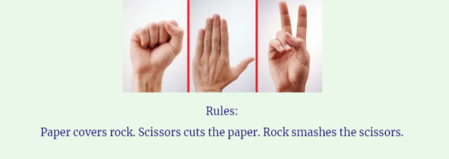

# Let's Play! Rock, Paper, Scissors. 

Let's Play! is a site with a simple Rock, Paper, Scissors game. This game is designed for adults and children alike. It provides the rules of the game, and buttons to select your choice during play. Users will compete against the completely random selection of the computer, ensuring a fair result.

## Features 

### Existing Features

- __The Let's Play! Rock, Paper, Scissors Heading and Sub-Heading__

  - Featured at the top of the page, the Let's Play! heading is easy to see for the user. Upon viewing the page, the user will be able to see the name of the site, and directly below it the name of the game they are about to play.
  

  
  

- __Rules Area__

- This section has a short explanation of the simple rules of the game.

  
  

- __The Game Area__

  - This section will allow the user to play the rock, paper, scissors game. 
  - 

  
  

- __The Score Area__

  - This section will allow the user to see exactly how many correct and incorrect answers they have provided. 

### Features Left to Implement

- 

## Testing 

In this section, you need to convince the assessor that you have conducted enough testing to legitimately believe that the site works well. Essentially, in this part you will want to go over all of your project’s features and ensure that they all work as intended, with the project providing an easy and straightforward way for the users to achieve their goals.

In addition, you should mention in this section how your project looks and works on different browsers and screen sizes.

You should also mention in this section any interesting bugs or problems you discovered during your testing, even if you haven't addressed them yet.

If this section grows too long, you may want to split it off into a separate file and link to it from here.

### Validator Testing 

- HTML
    - No errors were returned when passing through the official [W3C validator](https://validator.w3.org/nu/?doc=https%3A%2F%2Fcode-institute-org.github.io%2Flove-maths%2F)
- CSS
    - No errors were found when passing through the official [(Jigsaw) validator](https://jigsaw.w3.org/css-validator/validator?uri=https%3A%2F%2Fvalidator.w3.org%2Fnu%2F%3Fdoc%3Dhttps%253A%252F%252Fcode-institute-org.github.io%252Flove-maths%252F&profile=css3svg&usermedium=all&warning=1&vextwarning=&lang=en)
- JavaScript
    - No errors were found when passing through the official [Jshint validator](https://jshint.com/)
      - The following metrics were returned: 
      - There are 11 functions in this file.
      - Function with the largest signature takes 2 arguments, while the median is 0.
      - Largest function has 10 statements in it, while the median is 3.
      - The most complex function has a cyclomatic complexity value of 4 while the median is 2.

### Unfixed Bugs

You will need to mention unfixed bugs and why they were not fixed. This section should include shortcomings of the frameworks or technologies used. Although time can be a big variable to consider, paucity of time and difficulty understanding implementation is not a valid reason to leave bugs unfixed. 

## Deployment

- The site was deployed to GitHub pages. The steps to deploy are as follows: 
  - Open the repository on GitHub 
  - Navigate to the Settings tab 
  - Select the Pages tab on left-hand side
  - From the source section drop-down menu, select the Main Branch, and save
  - Once the main branch has been saved, the page will be automatically refreshed with a detailed ribbon display to indicate the successful deployment
  - It may be necessary to refresh the page to view the live link

The live link can be found here - https://michellecorrigan.github.io/lets-play/

- To run localy:

  1. Log in to GitHub and click on repository to download [lets-play](github.com/MichelleCorrigan/lets-play)
  2. Select Code and click Download the ZIP file.
  3. After download you can extract the file and use it in your local environment
- Alternatively you can Clone or Fork this repository [lets-play](github.com/MichelleCorrigan/lets-play) into your github account.

## Credits 

In this section you need to reference where you got your content, media and extra help from. It is common practice to use code from other repositories and tutorials, however, it is important to be very specific about these sources to avoid plagiarism. 

You can break the credits section up into Content and Media, depending on what you have included in your project. 

### Content 

- The text for the Home page was taken from Wikipedia Article A
- Instructions on how to implement form validation on the Sign Up page was taken from [Specific YouTube Tutorial](https://www.youtube.com/)
- The icons in the footer were taken from [Font Awesome](https://fontawesome.com/)

### Media

- The photos used on the home and sign up page are from This Open Source site
- The images used for the gallery page were taken from this other open source site
